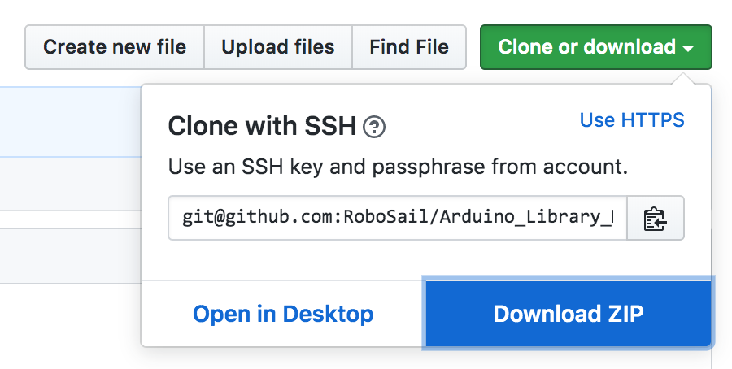

Arduino Library Dependencies for RoboSail
=========================================

This repository contains all Arduino library dependencies for RoboSail, bundled here for ease of installation and consistency

Libraries contain hardware-specific code provided by the component manufacturer. Simple components like the wind direction encoder send a PWM signal, which Arduino is already capable of interpreting, so no additional library is necessary. Both the Compass and GPS modules come with libraries from the manufacturer and have libraries created by the RoboSail team for ease of use.

Installation
------------

This repository is meant to be downloaded as a zipfile, as shown:

Copy the libraries contained in the zipfile to the Libraries folder in the Sketchbook location. You can check/set this in the Arduino IDE preferences.

> Note that you should not have a `Arduino_Library_Dependencies` folder inside your Arduino `Libraries` folder -- the Arduino IDE does not understand libraries stored in subfolders.  The _contents_ of the `Arduino_Library_Dependencies` folder should be moved directly into `Libraries`.

